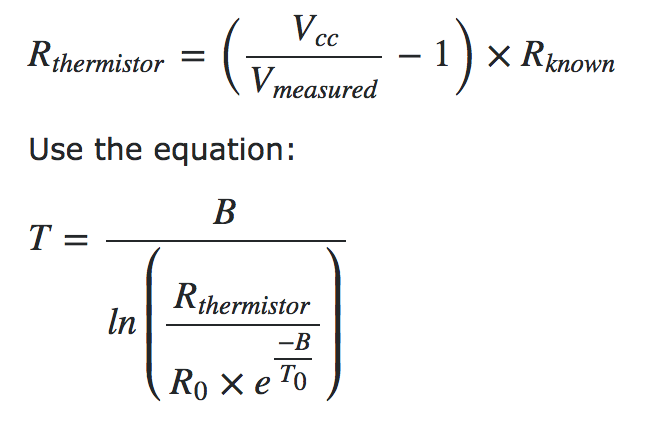

# Internet of Things Networking Session:

## Part 1: Build a Simple Sensor App!
So you've probably all heard of the "Internet of Things." It's a big trending industry and especially as healthcare professionals, it's important to understand the main concepts behind it. 

Explanation about how a thermistor works.

# Step 0: Download Necessary Software and Know Hardware

1. Arduino: https://www.arduino.cc/en/Main/Software
2. Processing: https://processing.org/download/


Hardware List:

1. Arduino Uno Chip
2. Circuit Board
3. 3 Wires
4. Sensor (temperature, distance, etc.)
In our case: Ocr TM 5 Pcs NTC 10K 3950 Ohm Waterproof Digital Thermal Temperature Sensor Probe 1M

# Step 1 Setup:
Open up Arduino and setup the necessary framework. 
Your file should look like this:

```
void setup() {
  // put your setup code here, to run once:  
}

void loop() {
  // main code goes here: runs in a loop
}
```
You will need to do some initialization to make Arduino work. Think of Arduino like a mini computer that can perform some computation/processing work. You just need to tell it what to do.

Here you will initialize:
- the serial port for communication
- variable for keeping track of voltage reading from temperature sensor
- the pin the thermistor is using

```
// initialize global variables here
#define THERMISTORPIN A0    // the pin that will read in the voltage at thermistor
float tempReading = 0;      // variable to keep track of temperature

void setup() {
  // put your setup code here, to run once: 
  Serial.begin(9600);
}

void loop() {
  // main code goes here: runs in a loop
}
```


# Step 2 Read In Voltages:
Read in the voltage values and utilize the following equation to convert into resistance. From resistance we can convert to temperature.




We also want to add some print statements to understand what is going on.

```
// initialize global variables here
#define THERMISTORPIN A0    // the pin that will read in the voltage at thermistor
float tempVoltReading = 0;      // variable to keep track of temperature

// themistor settings
int BETA = 3950;
int R0 = 10000;

void setup() {
  // put your setup code here, to run once: 
  Serial.begin(9600);
}

void loop() {
  // main code goes here: runs in a loop
  float RTherm;

  // read in analog value at the thermistor pin
  tempVoltReading = analogRead(THERMISTORPIN);

  // print some messages
  Serial.print("Analog reading is: ");
  Serial.println(tempVoltReading);

  // convert voltage reading to resistance
  RTherm = R0 / (1023 / tempVoltReading-1);
  Serial.print("Thermistor resistance is ");
  Serial.println(RTherm);

  delay(1000); // delay 1 second 
}
```


# Step 3 Improving Solution:
Getting better readings.

When doing analog readings, especially with a 'noisy' board like the arduino, we suggest two tricks to improve results. One is to use the 3.3V voltage pin as an analog reference and the other is to take a bunch of readings in a row and average them.
The first trick relies on the fact that the 5V power supply that comes straight from your computer's USB does a lot of stuff on the Arduino, and is almost always much noisier than the 3.3V line (which goes through a secondary filter/regulator stage!)

Taking multiple readings to average out the result helps get slightly better results as well, since you may have noise or fluctuations, we suggest about 5 samples.

```
// initialize global variables here
#define THERMISTORPIN A0    // the pin that will read in the voltage at thermistor
#define NUMSAMPLES 5     // # of samples to average over
int samples[NUMSAMPLES];    // array to hold values of thermistor

// themistor settings
int BETA = 3950;
int R0 = 10000;

void setup() {
  // put your setup code here, to run once: 
  Serial.begin(9600);
  analogReference(EXTERNAL);
}

void loop() {
  // main code goes here: runs in a loop
  float RTherm = 0;
  float average = 0;

  // get NUMSAMPLES of thermistor reading
  for (int i=0; i<NUMSAMPLES; i++) {
    samples[i] = analogRead(THERMISTORPIN);
    delay(20);
  }

  // compute average reading
  for (int i=0; i<NUMSAMPLES; i++) {
    average += samples[i];
  }
  average /= NUMSAMPLES;
  // print some messages
  Serial.print("Analog reading is: ");
  Serial.println(average);

  // convert voltage reading to resistance
  RTherm = R0 / (1023 / average-1);
  Serial.print("Thermistor resistance is ");
  Serial.println(RTherm);

  delay(1000); // delay 1 second 
}
```

# Step 4 Applying Steinhart Equation To Get Temperature

Now we want to apply the equation we saw earlier to get temperature readings.

```
// initialize global variables here
#define THERMISTORPIN A0    // the pin that will read in the voltage at thermistor
#define NUMSAMPLES 5       // # of samples to average over
// resistance at 25 degrees C
#define THERMISTORNOMINAL 10000      
// temp. for nominal resistance (almost always 25 C)
#define TEMPERATURENOMINAL 25  

long mstime = 0;
float tempVoltReading = 0;  // variable to keep track of temperature
int samples[NUMSAMPLES];    // array to hold values of thermistor

// themistor settings
int BETA = 3950;
int R0 = 10000;

void setup() {// put your setup code here, to run once: 
  Serial.begin(9600);
  analogReference(EXTERNAL); 
}

void loop() { // main code goes here: runs in a loop
  float average=0;
  float steinhart=0;
  float Rtherm = 0;
  
  // Step 3: get NUMSAMPLES of thermistor reading
  for (int i=0; i<NUMSAMPLES; i++) {
    samples[i] = analogRead(THERMISTORPIN); // read in analog value at the thermistor pin
    delay(20);
  }

  // Step 3: compute average reading
  for (int i=0; i<NUMSAMPLES; i++) {
    average += samples[i];
  }
  average /= NUMSAMPLES;
  
  // print some messages
  Serial.print("Analog reading is: ");
  Serial.println(average);

  // Step 2: convert voltage reading to resistance
  average = R0 / (1023 / average - 1);
  Serial.print("Thermistor resistance is ");
  Serial.println(average);

  // Step 4: compute temperature
  steinhart = 1.0 / ((1.0/298.15) + (1/BETA)*log(Rtherm / R0));
  steinhart = average / THERMISTORNOMINAL;     // (R/Ro)
  steinhart = log(steinhart);                  // ln(R/Ro)
  steinhart /= BETA;                   // 1/B * ln(R/Ro)
  steinhart += 1.0 / (TEMPERATURENOMINAL + 273.15); // + (1/To)
  steinhart = 1.0 / steinhart;                 // Invert
  steinhart -= 273.15;                         // convert to C
 
  Serial.print("Temperature "); 
  Serial.print(steinhart);
  Serial.println(" *C");
  
  delay(1000); // delay 1 second 
}
```

# Step 5 Log Data In Text File

Now that we have a way of obtaining data from our sensor, we want to log the data and time somehow.

```
// initialize global variables here
#define THERMISTORPIN A0    // the pin that will read in the voltage at thermistor
#define NUMSAMPLES 5       // # of samples to average over
#define THERMISTORNOMINAL 10000    // resistance at 25 degrees C  
#define TEMPERATURENOMINAL 25  // temp. for nominal resistance (almost always 25 C)

long mstime = 0;
float tempVoltReading = 0;  // variable to keep track of temperature
int samples[NUMSAMPLES];    // array to hold values of thermistor

// themistor settings
int BETA = 3950;
int R0 = 10000;

void setup() {// put your setup code here, to run once: 
  Serial.begin(9600);
  analogReference(EXTERNAL); 
}

void loop() { // main code goes here: runs in a loop
  float average=0;
  float steinhart=0;
  float Rtherm = 0;
  
  // Step 3: get NUMSAMPLES of thermistor reading
  for (int i=0; i<NUMSAMPLES; i++) {
    samples[i] = analogRead(THERMISTORPIN); // read in analog value at the thermistor pin
    delay(20);
  }

  // Step 3: compute average reading
  for (int i=0; i<NUMSAMPLES; i++) {
    average += samples[i];
  }
  average /= NUMSAMPLES;
  
  // print some messages
//  Serial.print("Analog reading is: ");
//  Serial.println(average);

  // Step 2: convert voltage reading to resistance
  average = R0 / (1023 / average - 1);
//  Serial.print("Thermistor resistance is ");
//  Serial.println(average);

  // Step 4: compute temperature
  steinhart = 1.0 / ((1.0/298.15) + (1/BETA)*log(Rtherm / R0));
  steinhart = average / THERMISTORNOMINAL;     // (R/Ro)
  steinhart = log(steinhart);                  // ln(R/Ro)
  steinhart /= BETA;                   // 1/B * ln(R/Ro)
  steinhart += 1.0 / (TEMPERATURENOMINAL + 273.15); // + (1/To)
  steinhart = 1.0 / steinhart;                 // Invert
  steinhart -= 273.15;                         // convert to C
 
//  Serial.print("Temperature "); 
//  Serial.print(steinhart);
//  Serial.println(" *C");
  mstime = millis();
  Serial.print(mstime/1000.0);
  Serial.print(",");
  Serial.println(steinhart);
  
  delay(2000); // delay 1 second 
}
```

Check the "readFromIoT" file with Processing.

